# MyBeauty - AI-Powered Fragrance E-Commerce Platform

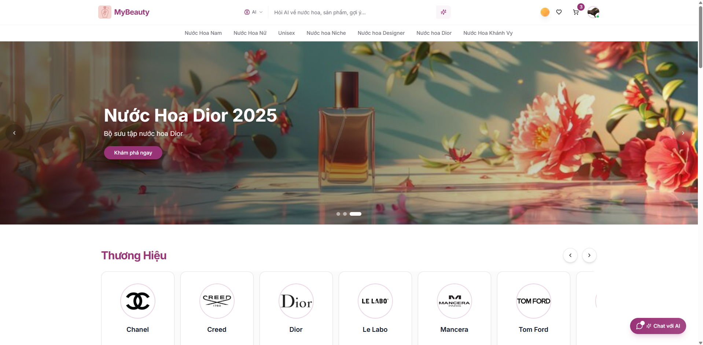

**🌐 Live Demo:** [https://nextjs-fpl-datn.vercel.app/](https://nextjs-fpl-datn.vercel.app/)

---

## 🧴 About The Project

**MyBeauty** is a full-stack, AI-powered e-commerce web application specializing in fragrances.
It’s designed to deliver a **premium, intelligent, and seamless shopping experience** — built from scratch as a graduation project to showcase **real-world software engineering capability**.

This project demonstrates mastery across **frontend, backend, database, AI integration, and payment systems** within a clean, scalable architecture.
It represents not just an e-commerce site, but a foundation for future **AI-driven retail innovation**.

---

## ✨ Key Features

### 🤖 **AI-Powered Discovery**

- **AI Smart Search:** Users can search fragrances by describing moods or contexts (e.g., _"a gentle floral scent for a spring wedding"_) instead of relying on keywords.
- **AI Conversational Chatbot:** A virtual fragrance consultant that assists users, recommends perfumes, and answers detailed product questions.

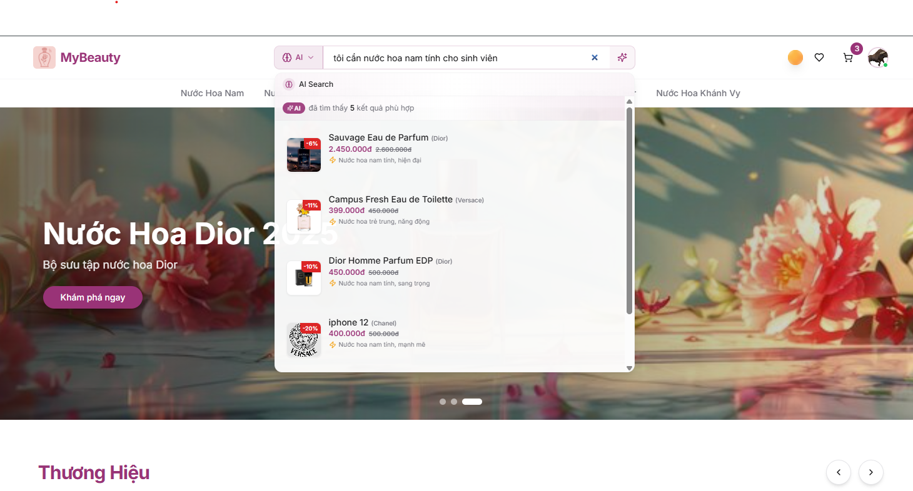
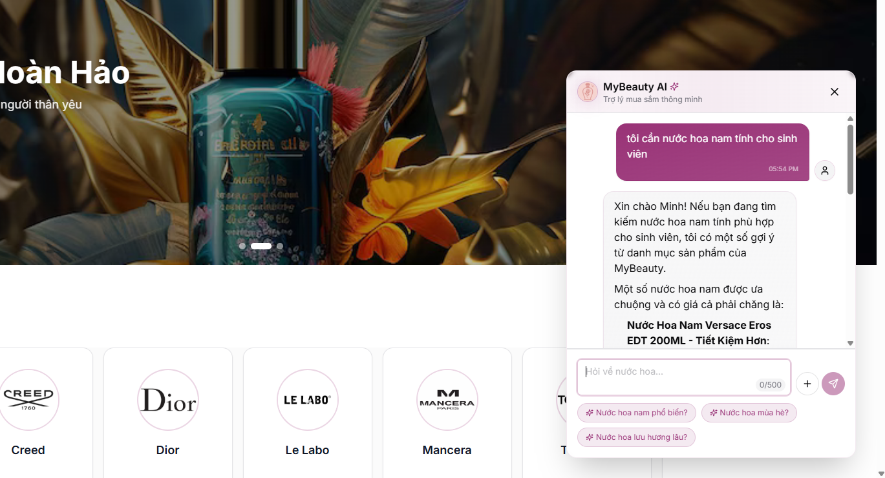

---

### 💳 **Modern & Secure Payments**

- Integrated **MoMo Wallet** for one-tap digital payments.
- Supports **guest checkout** and **authenticated checkout** with order tracking.

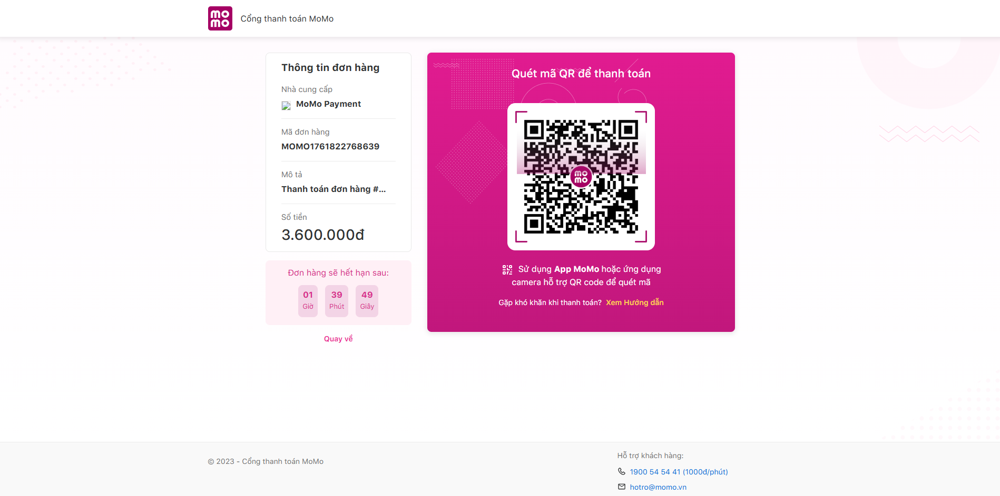

---

### ⚙️ **Comprehensive Admin Dashboard**

A powerful and intuitive admin system for complete store management:

- 🧩 **Product Management:** Add, edit, delete, and organize products by brand, category, and variants.
- 🛒 **Order Management:** Real-time tracking and control of all customer orders.
- 👥 **User & Role Management:** Fine-grained control of admin, staff, and customer permissions.
- 💸 **Discount Management:** Create and monitor promotional codes and campaigns.
- 📜 **Activity Log:** Tracks system-level actions for traceability and debugging.

#### 📸 Admin UI Showcase

> _A few sample screenshots below (not the entire set)._

| Feature                    | Preview                                                |
| -------------------------- | ------------------------------------------------------ |
| Dashboard Overview         | 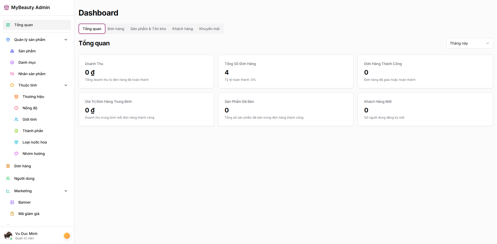       |
| Product Management         | 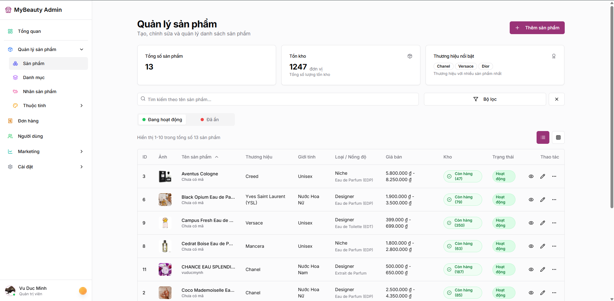     |
| Add New Product            | 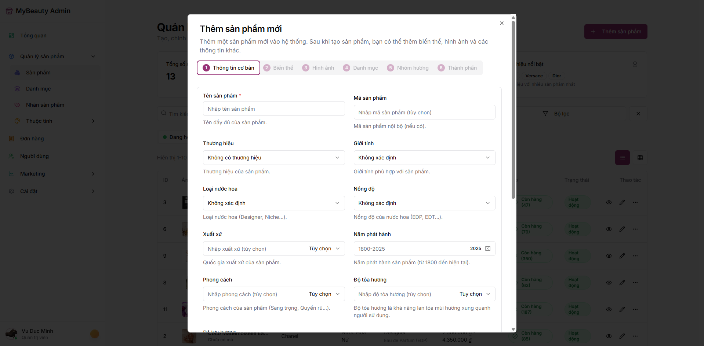      |
| Order Management           | 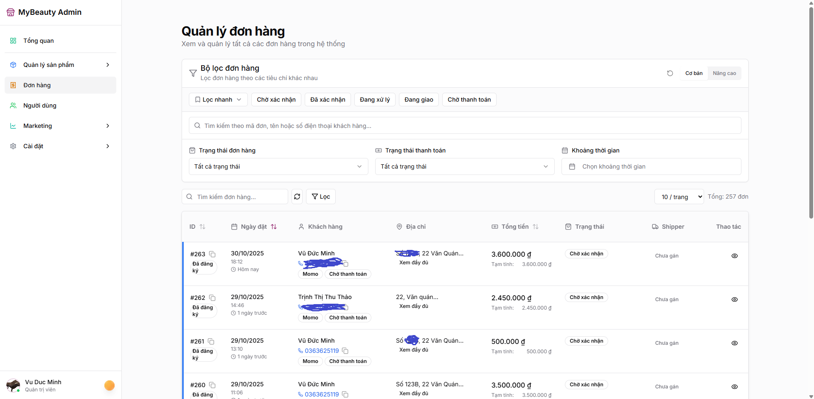      |
| User Management            | 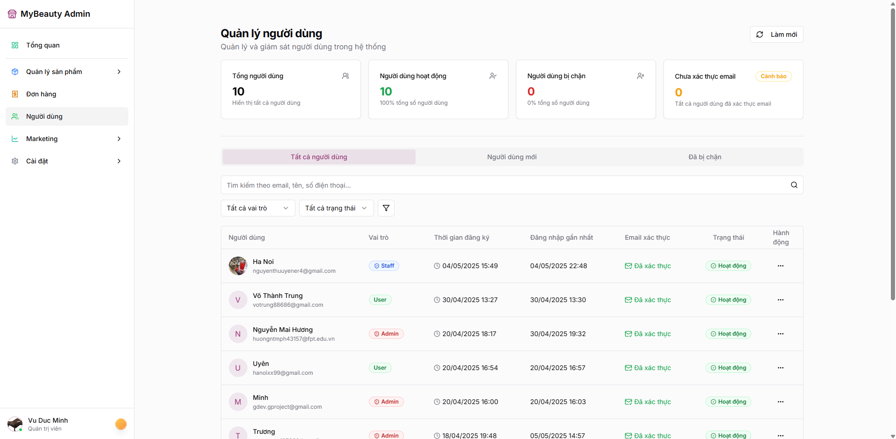        |
| Discount Management        | 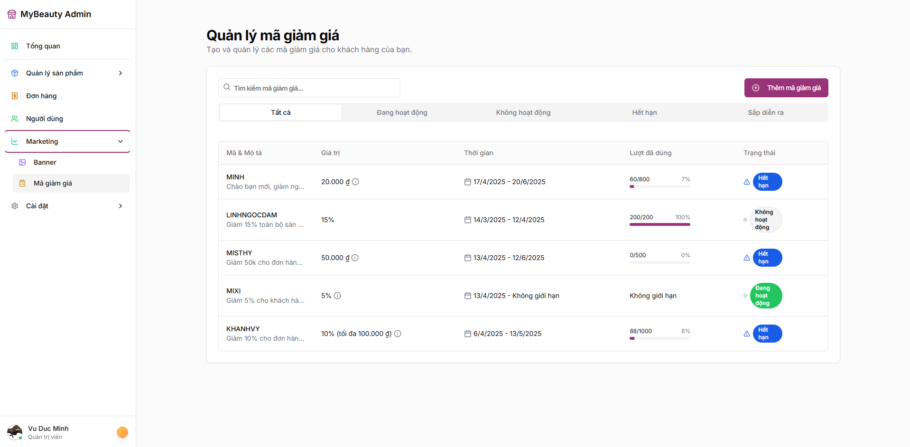 |
| Activity Log / Audit Trail | 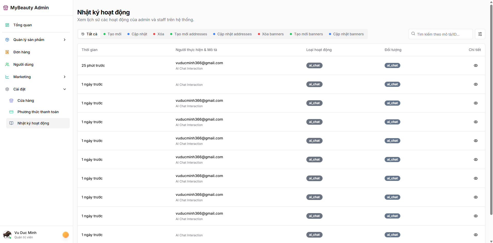    |

---

### 🛍️ **User Experience Highlights**

#### 🏠 Homepage & Product Discovery

- Modern, responsive design built with **TailwindCSS** and **ShadCN UI**.
- Personalized recommendations powered by AI.

| Page         | Preview                                    |
| ------------ | ------------------------------------------ |
| Homepage (1) |      |
| Homepage (2) | 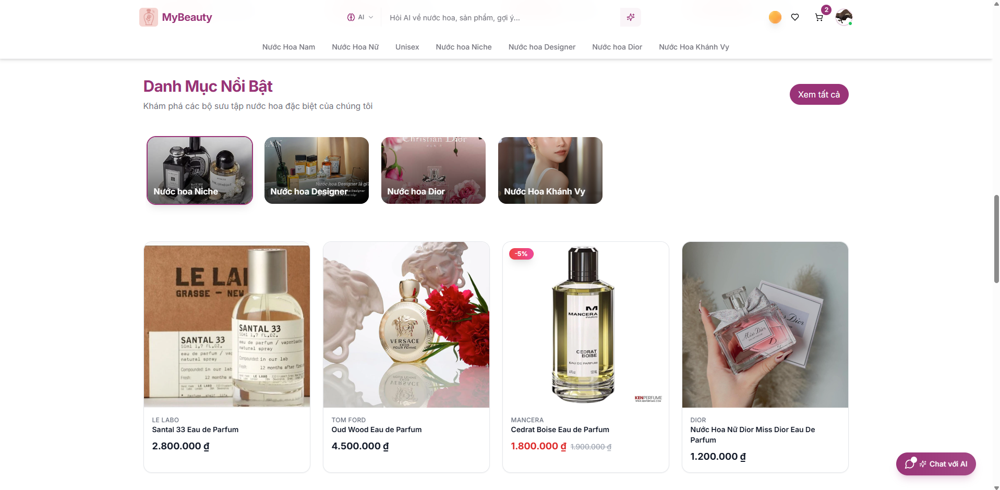 |

#### 🧴 Product & Shopping Flow

| Page                        | Preview                                              |
| --------------------------- | ---------------------------------------------------- |
| Product Detail              | 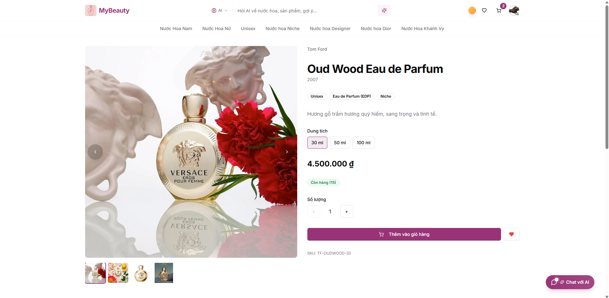 |
| Shopping Cart               | 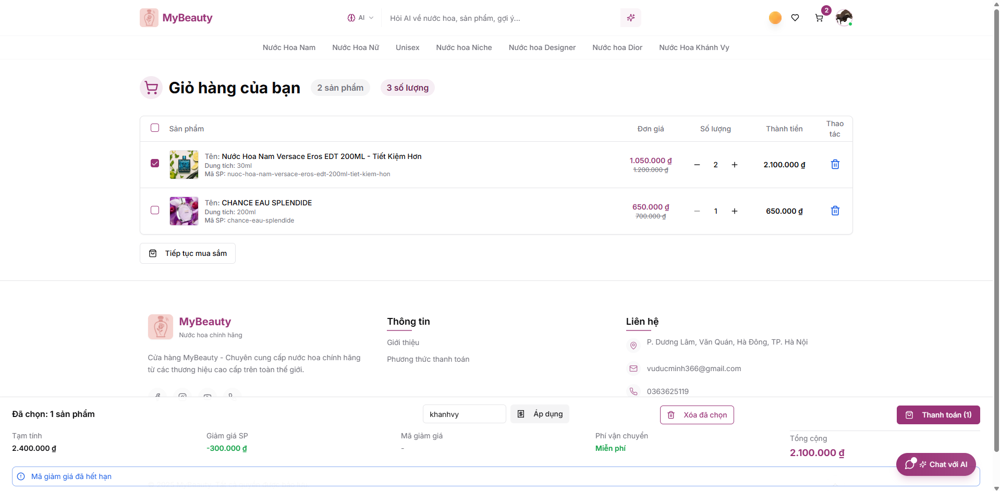                    |
| Checkout                    | 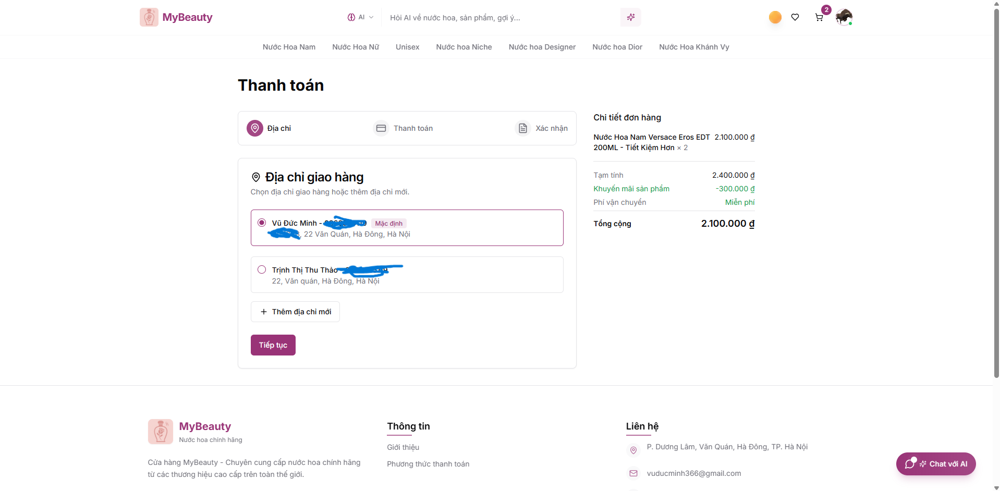              |
| MoMo QR Payment             |                |
| User Order History          | 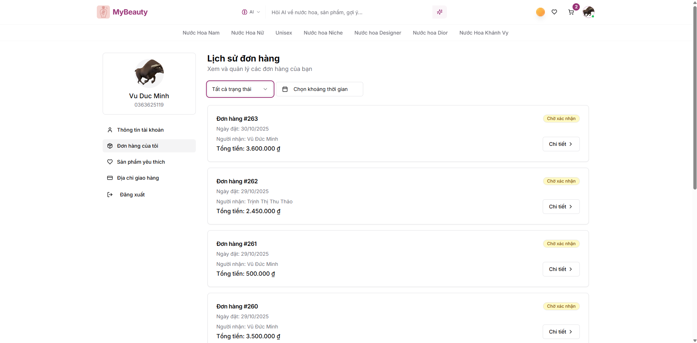          |
| Shipping Address Management | 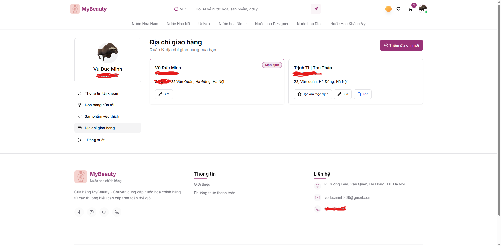       |
| Favorite Products           | 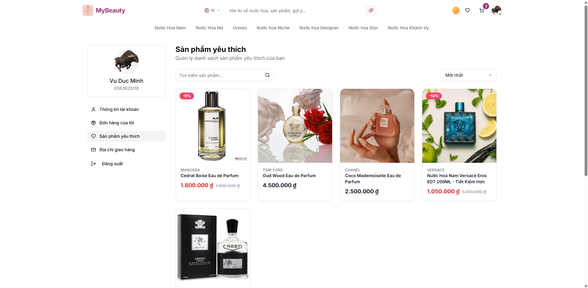               |
| Account Information         | 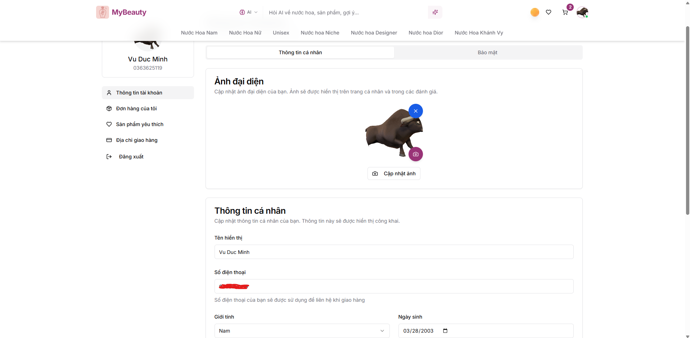 |

> 🖼️ _Note: These are representative captures, not the complete UI set._

---

## 🧠 Tech Stack

| Category             | Technologies                                                                   |
| -------------------- | ------------------------------------------------------------------------------ |
| **Framework**        | [Next.js 14+ (App Router)](https://nextjs.org/)                                |
| **Language**         | [TypeScript](https://www.typescriptlang.org/)                                  |
| **Styling**          | [Tailwind CSS](https://tailwindcss.com/) + [Shadcn UI](https://ui.shadcn.com/) |
| **Database & Auth**  | [Supabase (PostgreSQL)](https://supabase.io/)                                  |
| **State Management** | [TanStack Query (React Query)](https://tanstack.com/query/latest)              |
| **AI Integration**   | [Groq API](https://groq.com/)                                                  |
| **Payment Gateway**  | [MoMo API](https://developers.momo.vn/)                                        |
| **Deployment**       | [Vercel](https://vercel.com/)                                                  |

---

## ⚡ Getting Started

### Prerequisites

- Node.js v18+
- Yarn (or npm/pnpm)
- Supabase account for your database, auth, and storage

### Installation

```bash
git clone https://github.com/gdevgproject/nextjs-fpl-datn.git
cd nextjs-fpl-datn
yarn install
```

### Environment Setup

Create `.env.local` in the project root and configure your keys:

```env
NEXT_PUBLIC_SUPABASE_URL=YOUR_SUPABASE_URL
NEXT_PUBLIC_SUPABASE_ANON_KEY=YOUR_SUPABASE_ANON_KEY
```

### Run Development Server

```bash
yarn dev
```

Visit **[http://localhost:3000](http://localhost:3000)** to view the app.

---

## 🏁 Conclusion

MyBeauty demonstrates a **holistic understanding of full-stack web development**, with emphasis on **clean architecture, user experience, and AI integration**.
This project reflects the commitment to building scalable, maintainable, and production-ready systems — a standard expected from top-tier engineers.
